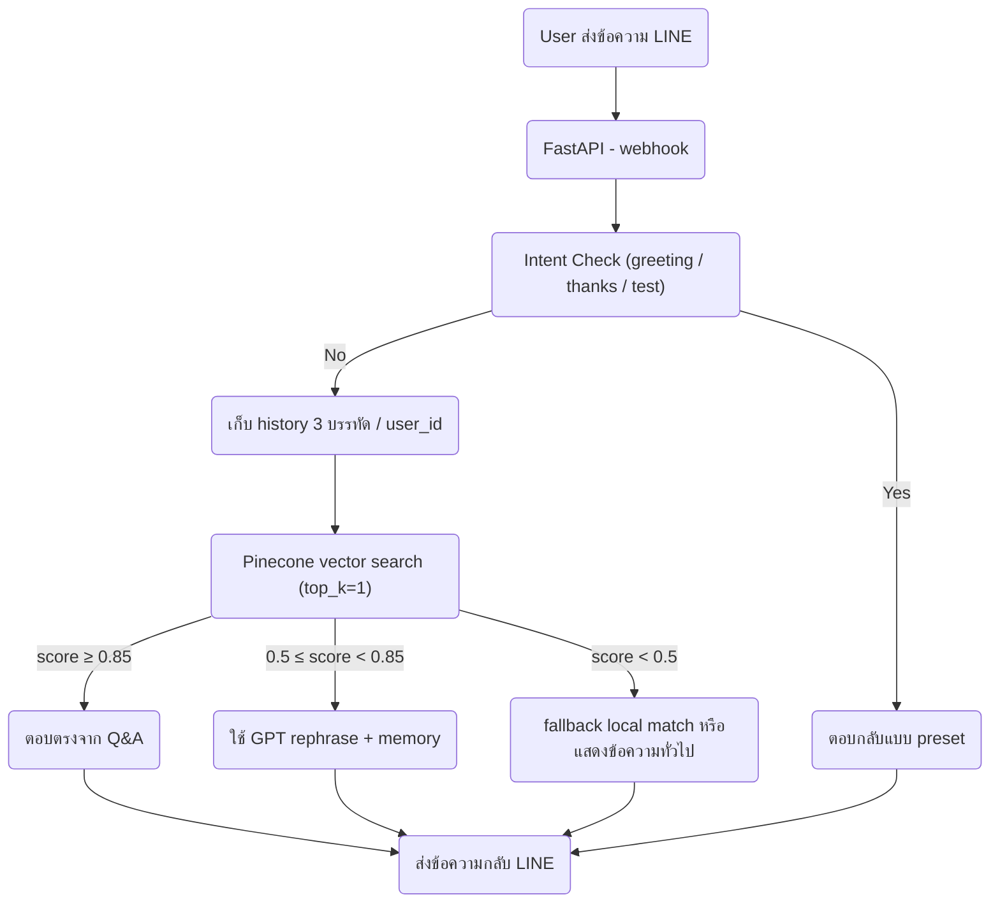

# LINE OA Q&A Chatbot (with Pinecone + GPT Hybrid + Memory)

ระบบ LINE Bot สำหรับตอบคำถามอัตโนมัติ  
โดยใช้ Pinecone Vector Search + GPT Rephrasing + Fallback Matching + Memory 3 บรรทัด เพื่อให้ดูเหมือนพูดคุยกับคนจริง

---

## Features

- ใช้ Pinecone vector DB match Q&A ที่ใกล้เคียง
- ใช้ GPT (gpt-3.5-turbo หรือ gpt-4) ช่วยแต่งคำตอบ
- รองรับคำทักทายและขอบคุณ
- Fallback local match หาก Pinecone หรือ GPT ใช้งานไม่ได้
- จำบทสนทนาย้อนหลัง 3 ข้อความล่าสุด ต่อ user เพื่อใช้เป็น context
- เพิ่ม Q&A ได้ง่ายผ่าน `qa_data.json` แล้วฝังใหม่ด้วย script

---

## ระบบ Hybrid Matching & Memory

ระบบจะประมวลผลคำถามโดยพิจารณาตามลำดับ:

1. Greeting/Thanks/Testing → ตอบกลับแบบ preset
2. ส่งคำถามเข้า Pinecone → vector match

- ถ้า score ≥ 0.85 → ตอบคำตอบจาก Q&A ตรง ๆ
- ถ้า score 0.50 - 0.84 → ส่งให้ GPT rephrase + ปรับภาษาตามคำถามและ context
- ถ้า score ต่ำกว่า 0.5 → ใช้ local fuzzy match หรือแสดง fallback message

3. ใช้ memory context ล่าสุด 3 ข้อความ (ต่อ user_id) เพื่อช่วยให้ GPT เข้าใจบทสนทนา

---

## Architecture (with Memory)



---

## Project Structure

```
.
├── main.py                   # LINE Webhook Endpoint + memory logic
├── embed_qa_to_pinecone.py   # ฝัง Q&A เข้า Pinecone
├── qa_data.json              # คำถาม-คำตอบทั้งหมด
├── .env                      # เก็บ API keys
├── requirements.txt
├── render.yaml               # ใช้ deploy ขึ้น Render
└── utils/
    ├── qa_matcher.py          # Matching + fallback + memory handler
    ├── pinecone_utils.py      # ค้นหาจาก Pinecone
    ├── prompt_builder.py      # สร้าง prompt สำหรับ GPT
    ├── intent_detector.py     # ตรวจสอบว่าเป็นคำถามไหม / greeting
```

---

## Setup

1. .env:

```env
OPENAI_API_KEY=...
PINECONE_API_KEY=...
PINECONE_INDEX_NAME=qa-index
PINECONE_REGION=...
LINE_CHANNEL_SECRET=...
LINE_CHANNEL_ACCESS_TOKEN=...
```

2. ฝัง Q&A ลง Pinecone:

```bash
python embed_qa_to_pinecone.py
```

## Run local:

1. run Server:

```bash
python -m uvicorn main:app --reload --host 0.0.0.0 --port 8000
```

2. ใช้ ngrok เพื่อ expose local webhook:

```bash
ngrok http 8000
```

3. ตั้งค่า Webhook URL ใน LINE Developer Console

---

## Notes

- การเพิ่ม Q&A ให้แก้ไข qa_data.json และรัน embed_qa_to_pinecone.py อีกครั้ง

- ระบบจะจำข้อความล่าสุด 3 บรรทัดแยกตาม user_id

- ใช้ GPT-3.5-turbo เป็น default

---
