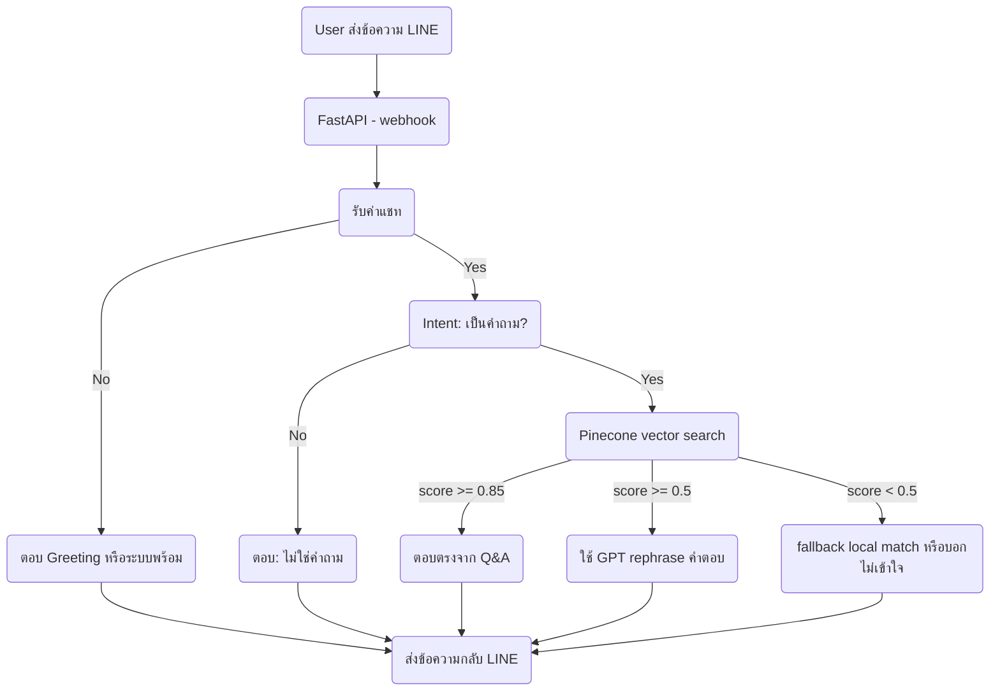

# LINE OA Q&A Chatbot (with Pinecone + GPT Hybrid)

ระบบ LINE Bot สำหรับตอบคำถาม
โดยใช้ Pinecone Vector Search + GPT Rephrasing + Fallback Matching เพื่อให้ดูเหมือนพูดคุยกับคนจริง

---

## Features

- ใช้ Pinecone vector DB match Q&A ที่ใกล้เคียง
- ใช้ GPT (gpt-3.5-turbo หรือ gpt-4-turbo) ช่วยแต่งคำตอบให้นุ่มนวล
- มีระบบ fallback local match หาก GPT หรือ Pinecone ใช้งานไม่ได้
- ตอบคำทักทาย / ขอบคุณ / ทดสอบ ได้แบบมนุษย์
- อัปเดต Q&A ได้ง่ายผ่าน `qa_data.json`

---

## Architecture



---

## Project Structure

```
.
├── main.py                   # LINE Webhook Endpoint
├── embed_qa_to_pinecone.py   # ฝัง Q&A เข้า Pinecone
├── qa_data.json              # คำถาม-คำตอบทั้งหมด
├── .env                      # เก็บ API keys
├── requirements.txt
├── render.yaml               # (optional) สำหรับ deploy ขึ้น Render
└── utils/
    ├── qa_matcher.py
    ├── pinecone_utils.py
    ├── prompt_builder.py
    ├── intent_detector.py
```

---

## Setup & Run

1. ติดตั้ง dependencies:

```bash
pip install -r requirements.txt
```

2. ตั้งค่า .env:

```env
OPENAI_API_KEY=...
PINECONE_API_KEY=...
PINECONE_INDEX_NAME=qa-index
PINECONE_REGION=...
LINE_CHANNEL_SECRET=...
LINE_CHANNEL_ACCESS_TOKEN=...
```

3. ฝัง Q&A ลง Pinecone:

```bash
python embed_qa_to_pinecone.py
```

4. รัน Server:

```bash
python -m uvicorn main:app --reload --host 0.0.0.0 --port 8000
```

5. ใช้ ngrok เพื่อ expose local webhook:

```bash
ngrok http 8000
```

6. ตั้งค่า Webhook URL ใน LINE Developer Console

---

## Notes

- สามารถเพิ่ม Q&A ได้โดยแก้ไข `qa_data.json` แล้วรัน `embed_qa_to_pinecone.py` ใหม่

---
